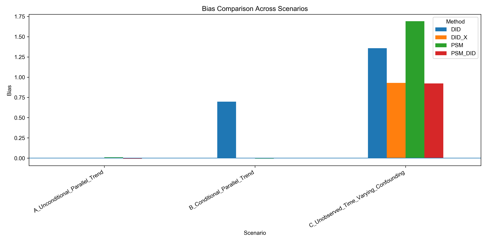
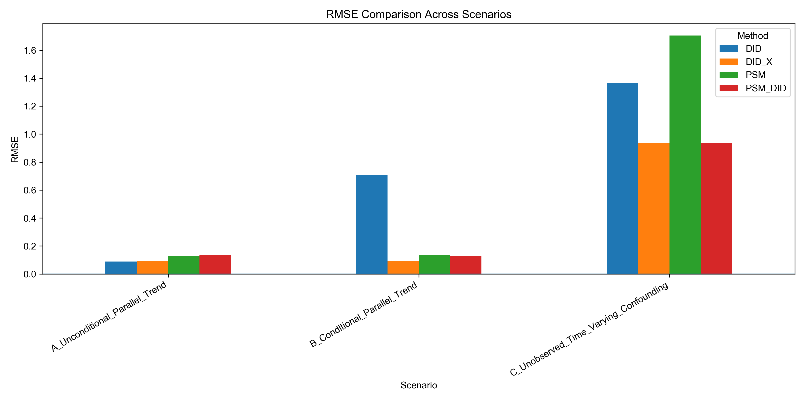
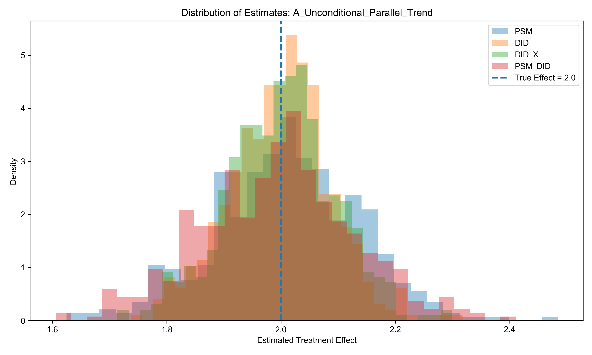
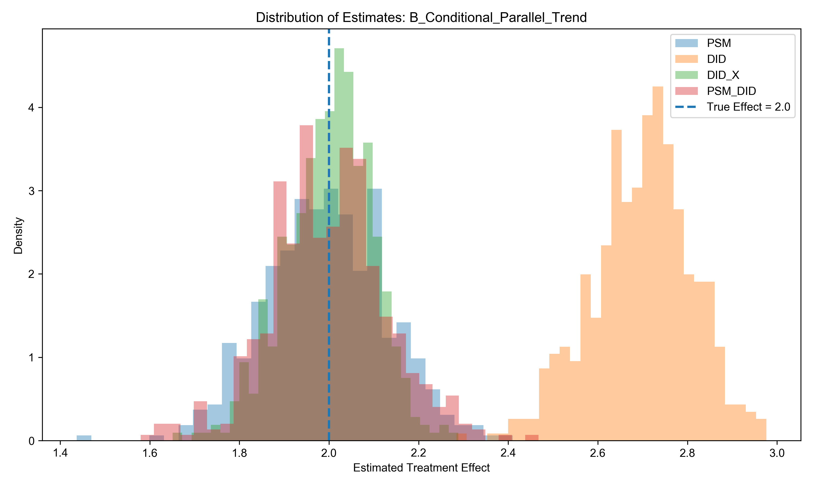
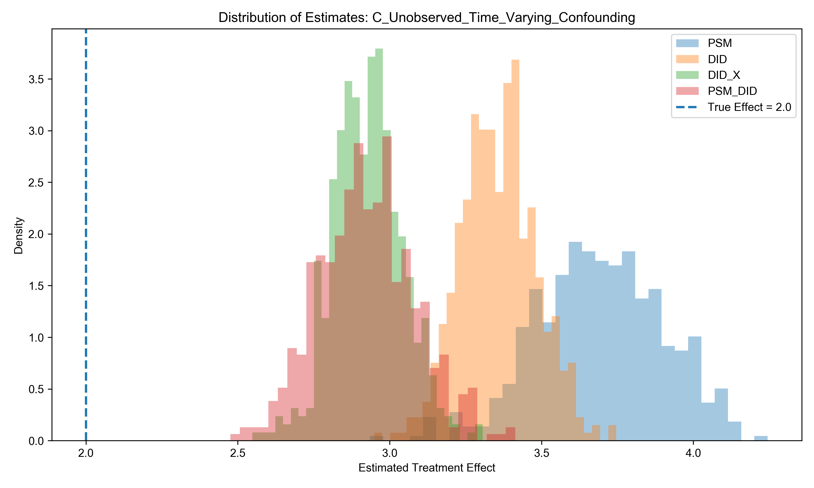
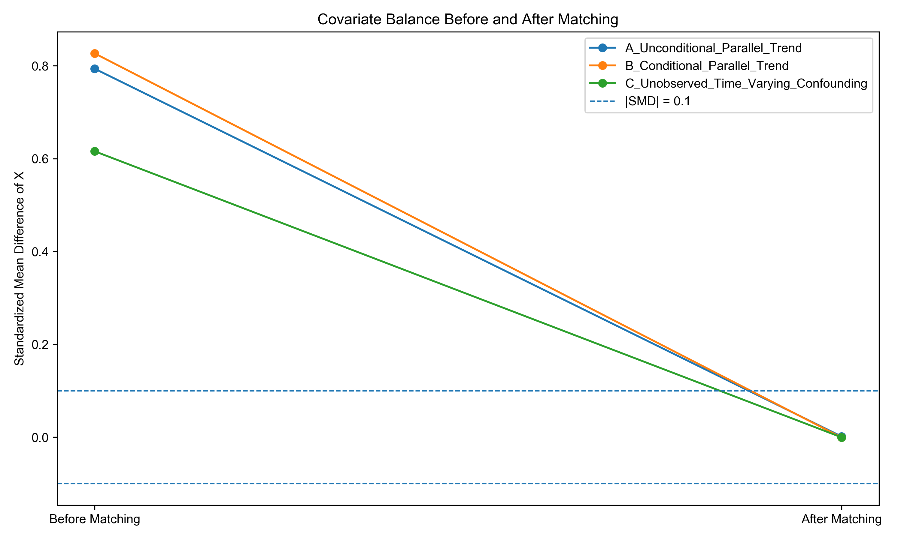
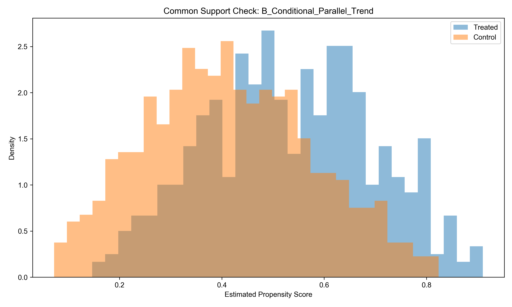

## 1  引言

在政策评估和项目评估中，研究者通常希望回答某项政策、干预或处理是否真正导致了结果变量的变化。然而，在观察性数据中，处理变量往往不是随机分配的。个体、企业或地区是否接受处理，通常与其处理前特征、发展基础或潜在趋势有关。因此，处理组和对照组之间观察到的结果差异并不能直接解释为处理效应，而可能同时包含真实因果效应和选择偏误。

PSM、DID和PSM-DID是处理这类问题的常用方法。PSM通过处理前协变量估计倾向得分，并在倾向得分相近的处理组和对照组之间进行比较，试图减少由可观测变量造成的选择偏误。DID则利用处理前后两个时期的数据，通过比较处理组和对照组的结果变化差异，消除时间不变的组间异质性。PSM-DID将二者进行结合，先通过PSM构造更可比的样本，再在匹配样本中实施DID。直观上，PSM-DID似乎比单独使用PSM或DID更稳健。但从识别假设看，PSM-DID是否有效，取决于处理组和对照组之间的趋势差异是否能够被处理前可观测协变量充分解释。

以**城市政策试点**为例，如果经济基础较好、产业结构更成熟的城市更容易被选为试点城市，同时这些城市即使没有政策也可能增长更快，那么直接使用DID就可能把原有增长趋势误认为政策效果。若这种趋势差异主要来自处理前可观测变量，PSM-DID可以通过匹配改善处理组和对照组的可比性；但若趋势差异来自地方治理能力、政策执行积极性等不可观测因素，匹配后的DID仍可能存在偏误。

基于这一问题，本文使用**Monte Carlo模拟**来检验PSM-DID的适用条件与失效边界，其优势在于可以人为设定数据生成过程、真实处理效应和偏误来源，从而观察不同估计方法在不同识别条件下的表现。

设定真实处理效应为：

$$
\tau = 2
$$

并分别构造三个模拟场景，在每个场景中，比较PSM、DID和PSM-DID三类方法，并额外加入控制协变量的DID作为参照，观察当趋势差异确实来自可观测协变量 $X$ 时，直接在变化值回归中控制 $X$ 是否也能降低偏误，从而更清晰地解释PSM-DID有效的原因。通过比较四类方法在三种场景下的Bias、RMSE和标准差等指标定量分析PSM-DID的适用条件与使用边界。

## 2  理论基础与研究思路

本文的理论出发点是潜在结果框架。在该框架下，个体 $i$ 在接受处理和未接受处理时分别存在两个潜在结果：

$$
Y_i(1), \quad Y_i(0)
$$

其中，$Y_i(1)$ 表示个体接受处理时的潜在结果，$Y_i(0)$ 表示个体未接受处理时的潜在结果。个体层面的处理效应可以表示为：

$$
\tau_i = Y_i(1)-Y_i(0)
$$

但在现实研究中，一个个体只能处于一种处理状态，因此研究者实际观察到的是：

$$
Y_i = D_iY_i(1)+(1-D_i)Y_i(0)
$$

其中， $D_i=1$ 表示个体接受处理， $D_i=0$ 表示个体未接受处理。由于无法同时观察同一个体在处理和未处理两种状态下的结果，因此因果推断的核心问题就是如何为处理组构造可信的反事实结果。

在观察性研究中，直接比较处理组和对照组的结果均值通常不能识别因果效应。观察到的组间差异可以分解为真实处理效应和选择偏误：

$$
E[Y|D=1]-E[Y|D=0]=E[Y(1)-Y(0)|D=1]+\left(E[Y(0)|D=1]-E[Y(0)|D=0]\right)
$$

其中，第一项是处理组平均处理效应，第二项是选择偏误，它表示如果处理组没有接受处理，其潜在结果是否本来就不同于对照组。只要这一项不为零，简单均值比较就会把处理前差异误认为处理效应。

PSM、DID和PSM-DID都可以理解为构造反事实的不同方式。PSM的思路是利用处理前协变量 $X_i$ 为处理组寻找相似的对照组。其核心假设是条件可忽略性：

$$
(Y_i(0),Y_i(1)) \perp D_i \mid X_i
$$

也就是说，在给定处理前协变量后，处理分配可以近似视为随机。PSM通常先估计倾向得分：

$$
e(X_i)=P(D_i=1|X_i)
$$

再在倾向得分相近的处理组和对照组之间比较结果。其优势在于能够缓解由可观测协变量造成的选择偏误，但局限在于只能处理可观测混淆，无法解决不可观测因素带来的偏误。

DID的思路则是利用处理前后的结果变化来构造反事实。在两期数据中，DID估计量可以写为：

$$
\hat{\tau}_{DID}=(\bar{Y}_{T,post}-\bar{Y}_{T,pre})-(\bar{Y}_{C,post}-\bar{Y}_{C,pre})
$$

DID并不要求处理组和对照组在处理前具有相同的结果水平，而是要求如果没有处理，二者应具有相同的变化趋势，即平行趋势假设：

$$
E[\Delta Y_i(0)|D_i=1]=E[\Delta Y_i(0)|D_i=0]
$$

因此，DID可以消除不随时间变化的组间异质性，但无法自动处理随时间变化的趋势差异。如果处理组本来就比对照组增长更快，普通DID会将这种趋势差异误认为处理效应。

在本文的模拟中，除普通DID外，还额外设置控制协变量的DID作为参照，在结果变化值上估计如下回归：

$$
\Delta Y_i = \alpha + \tau D_i + \beta X_i + \varepsilon_i
$$

其中， $\Delta Y_i = Y_{i,post}-Y_{i,pre}$ ， $X_i$ 为处理前协变量。如果趋势差异确实来自可观测协变量 $X_i$ ，那么在变化值回归中直接控制 $X_i$ 也应当能够降低普通DID的偏误。将其与PSM-DID进行比较，可以帮助判断PSM-DID的改善是否主要来自对可观测协变量差异的调整。

PSM-DID将PSM与DID结合，它的基本逻辑是：先使用处理前协变量进行匹配，使处理组和对照组在可观测特征上更接近；再在匹配样本中比较处理前后的结果变化。与普通DID相比，PSM-DID不再要求处理组和全部对照组满足无条件平行趋势，而是要求在给定处理前协变量之后满足条件平行趋势：

$$
E[\Delta Y_i(0)|D_i=1,X_i]=E[\Delta Y_i(0)|D_i=0,X_i]
$$

如果处理组和对照组的趋势差异主要来自可观测协变量 $X_i$，那么通过匹配改善 $X_i$ 上的平衡性后，匹配样本中的DID更可能恢复真实处理效应。相反，如果关键趋势差异来自不可观测因素，即使匹配后可观测变量达到平衡，条件平行趋势仍然可能不成立，PSM-DID也无法保证识别有效。

## 3  模拟设计

为了检验不同识别条件下PSM、DID和PSM-DID的估计表现，下面使用Python进行Monte Carlo模拟。模拟的基本单位为个体 $i$ ，每个个体在处理前和处理后各有一期观测值，分别记为 $Y_{i,pre}$ 和 $Y_{i,post}$。本文设定每次模拟的样本量为1000，并重复模拟500次。真实处理效应统一设定为：

$$
\tau = 2
$$

在每次模拟中，个体均具有一个处理前可观测协变量 $X_i$，该变量既可能影响个体是否接受处理，也可能影响结果变量水平或结果变化趋势。处理变量 $D_i$ 为二元变量，$D_i=1$ 表示个体进入处理组，$D_i=0$ 表示个体进入对照组。为模拟观察性研究中常见的非随机处理分配，本文使用logit形式生成个体接受处理的概率：

$$
P(D_i=1|X_i)=\frac{1}{1+\exp(-(-0.2+0.8X_i))}
$$

随后根据该概率生成处理状态 $D_i$。因此处理分配并不是完全随机的，而是与处理前协变量 $X_i$ 有关。由此，处理组和对照组在处理前特征上可能存在系统性差异，为PSM和PSM-DID提供了需要发挥作用的场景。

本文拟设置三个数据生成场景，分别对应不同的识别条件。

### 3.1 场景 A：无条件平行趋势成立

场景A用于模拟DID表现较好的基准情形。在该场景中，协变量 $X_i$ 会影响处理选择和结果水平，但不影响结果变化趋势。具体设定为：

$$
X_i \sim N(0,1)
$$

$$
\alpha_i \sim N(0,1)
$$

其中，$\alpha_i$ 表示个体层面的时间不变异质性。处理前结果为：

$$
Y_{i,pre} = \alpha_i + 1.5X_i + \varepsilon_{i,pre}
$$

处理后结果为：

$$
Y_{i,post} = \alpha_i + 1.5X_i + \lambda_t + \tau D_i + \varepsilon_{i,post}
$$

其中，$\lambda_t$ 表示共同时间趋势，$\varepsilon_{i,pre}$ 和 $\varepsilon_{i,post}$ 为随机误差项。在该设定下，$X_i$ 会导致处理组和对照组在结果水平上存在差异，但不会导致二者在未接受处理时具有不同的结果变化趋势。因此，处理组和对照组满足无条件平行趋势。理论上，普通DID应当能够较好识别真实处理效应。

### 3.2 场景B：条件平行趋势成立

场景B用于模拟PSM-DID可能优于普通DID的情形。在该场景中，协变量 $X_i$ 不仅影响处理选择和结果水平，还会影响结果变化趋势。具体设定为：

$$
Y_{i,pre} = \alpha_i + 1.5X_i + \varepsilon_{i,pre}
$$

$$
Y_{i,post} = \alpha_i + 1.5X_i + \lambda_t + \delta_x X_i + \tau D_i + \varepsilon_{i,post}
$$

其中，$\delta_x$ 表示协变量 $X_i$ 对结果变化趋势的影响，本文设定 $\delta_x=1.0$。由于处理分配也受到 $X_i$ 影响，处理组和对照组在 $X_i$ 的分布上存在差异；同时，$X_i$ 又影响结果变化趋势。因此，即使没有处理，处理组和对照组的平均结果变化也可能不同，普通DID的无条件平行趋势假设不再成立。

但是，该场景中的趋势差异完全来自可观测协变量 $X_i$。因此，在给定 $X_i$ 后，处理组和对照组的反事实变化趋势可以被认为是相同的，即该场景不满足无条件平行趋势，但满足条件平行趋势。理论上，PSM-DID通过匹配改善处理组和对照组在 $X_i$ 上的平衡性后，应当能够降低普通DID的偏误。控制协变量的DID也应在该场景中表现较好，因为它直接在变化值回归中控制了导致趋势差异的 $X_i$。

### 3.3 场景 C：存在不可观测时间变化混淆

场景C用于模拟PSM-DID可能失效的情形。在该场景中，除可观测协变量 $X_i$ 外，还引入一个研究者无法观测到的变量 $U_i$。该变量同时影响处理选择和结果变化趋势。具体设定为：

$$
U_i \sim N(0,1)
$$

处理分配机制变为：

$$
P(D_i=1|X_i,U_i)=\frac{1}{1+\exp(-(-0.2+0.6X_i+0.9U_i))}
$$

处理前结果为：

$$
Y_{i,pre} = \alpha_i + 1.5X_i + 1.0U_i + \varepsilon_{i,pre}
$$

处理后结果为：

$$
Y_{i,post} = \alpha_i + 1.5X_i + 1.0U_i + \lambda_t + \delta_xX_i + \rho_uU_i + \tau D_i + \varepsilon_{i,post}
$$

其中，$\rho_u$ 表示不可观测变量 $U_i$ 对结果变化趋势的影响，本文设定 $\rho_u=1.2$。在实际估计中，研究者只能观察到 $X_i$、$D_i$、$Y_{i,pre}$ 和 $Y_{i,post}$，无法观察到 $U_i$。因此，PSM和PSM-DID只能基于 $X_i$ 进行匹配，不能直接平衡 $U_i$。

该场景下，即使匹配后处理组和对照组在 $X_i$ 上达到平衡，二者仍可能在不可观测变量 $U_i$ 上存在系统性差异。而 $U_i$ 又会影响结果变化趋势，因此条件平行趋势仍然可能不成立。理论上，PSM-DID在该场景中仍会产生偏误。

### 3.4 估计方法与评价指标

在每一次Monte Carlo模拟中，本文分别估计四类方法：单独PSM、普通DID、控制协变量的DID和PSM-DID。匹配过程采用logit模型估计倾向得分，并在共同支撑区域内进行一对一最近邻匹配。普通DID、控制协变量的DID和PSM-DID均基于个体结果变化值 $\Delta Y_i=Y_{i,post}-Y_{i,pre}$ 进行估计，使不同方法在同一组数据生成过程下具有可比性。

在500次重复模拟后，本文计算各方法估计值的平均值、Bias、RMSE和标准差。Bias用于衡量估计结果是否系统性偏离真实处理效应，RMSE同时反映偏误和估计波动，标准差则反映估计结果在重复模拟中的稳定性。除数值指标外，本文还报告估计值分布、匹配前后协变量平衡情况以及倾向得分共同支撑情况，用于辅助判断匹配质量和估计可靠性。

## 4  模拟结果分析与理论解释

### 4.1 估计结果汇总

表1报告了三种数据生成场景下四类估计方法的Monte Carlo模拟结果。由于本文设定真实处理效应为 $\tau=2$，因此平均估计值越接近2，Bias和RMSE越小，说明该方法在相应场景下的估计表现越好。其中，Bias反映估计量是否系统性偏离真实处理效应，RMSE反映偏误和估计波动。

**表 4-1  不同场景下四类估计方法的 Monte Carlo 结果**

|       场景       | 方法 | 平均估计值 | Bias | RMSE | 标准差 |
|--------------------|---|---:|---:|---:|---:|
| A：无条件平行趋势成立 | PSM | 2.010 | 0.010 | 0.127 | 0.127 |
| A：无条件平行趋势成立 | DID | 1.999 | -0.001 | 0.088 | 0.088 |
| A：无条件平行趋势成立 | 控制协变量的 DID | 1.999 | -0.001 | 0.094 | 0.094 |
| A：无条件平行趋势成立 | PSM-DID | 1.993 | -0.007 | 0.134 | 0.134 |
| B：条件平行趋势成立 | PSM | 1.993 | -0.007 | 0.135 | 0.135 |
| B：条件平行趋势成立 | DID | 2.697 | 0.697 | 0.706 | 0.112 |
| B：条件平行趋势成立 | 控制协变量的 DID | 2.001 | 0.001 | 0.095 | 0.095 |
| B：条件平行趋势成立 | PSM-DID | 1.997 | -0.003 | 0.130 | 0.130 |
| C：不可观测时间变化混淆 | PSM | 3.691 | 1.691 | 1.704 | 0.210 |
| C：不可观测时间变化混淆 | DID | 3.357 | 1.357 | 1.363 | 0.123 |
| C：不可观测时间变化混淆 | 控制协变量的 DID | 2.929 | 0.929 | 0.936 | 0.114 |
| C：不可观测时间变化混淆 | PSM-DID | 2.923 | 0.923 | 0.936 | 0.157 |

从整体结果看，三种场景下各方法的表现与理论预期基本一致。场景A中，无条件平行趋势成立，普通DID的平均估计值为1.999，Bias仅为-0.001，RMSE为0.088，是四类方法中最稳定的方法。场景B中，协变量 $X_i$ 同时影响处理选择和结果趋势，普通DID的Bias上升到0.697，而控制协变量的DID和PSM-DID的Bias分别仅为0.001和-0.003，说明当趋势差异来自可观测协变量时，对 $X_i$ 进行调整能够显著改善估计结果。场景C中，存在不可观测变量 $U_i$ 同时影响处理选择和结果趋势，四类方法均出现明显正向偏误，其中PSM-DID的Bias仍达到0.923，说明仅依靠可观测协变量匹配无法消除不可观测时间变化混淆。

为了更直观地比较不同方法在三种场景下的表现，本文进一步绘制Bias和RMSE对比图。

**图 4-1  不同场景下四类估计方法的Bias对比**

**图 4-2  不同场景下四类估计方法的RMSE对比**

不同方法的表现并不存在绝对优劣，而是取决于数据生成过程是否满足其识别假设。下面将结合三个场景分别展开分析。

### 4.2 场景A：无条件平行趋势成立时DID表现最好

场景A中，$X_i$ 影响处理选择和结果水平，但不影响结果变化趋势，因此处理组和对照组满足无条件平行趋势。模拟结果显示，普通DID的平均估计值为1.999，Bias仅为 -0.001，RMSE为0.088，是场景A中表现最稳定的方法。

从数据生成过程看，个体层面的时间不变异质性 $\alpha_i$ 同时进入处理前和处理后结果，和 $X_i$ 同时影响处理前后结果水平，但不影响结果变化趋势，因此在计算 $\Delta Y_i$ 时会被抵消。

**图 4-3  场景A下四类估计方法的估计值分布**

模拟结果与这一理论预期一致。普通DID的平均估计值为1.999，几乎等于真实处理效应；Bias仅为-0.001，RMSE为0.088，是场景A中表现最稳定的方法。这说明，当无条件平行趋势成立时，DID可以通过比较处理前后的变化准确恢复真实处理效应。相比之下，PSM和PSM-DID在该场景中虽然也接近真实值，但RMSE和标准差均高于普通DID。原因在于，场景A中DID的识别条件本来已经成立，匹配并不会进一步修正趋势差异，反而可能因为改变样本结构、减少有效样本或引入匹配误差，使估计波动略有增加。因此，在无条件平行趋势已经成立的情况下，PSM-DID未必优于直接使用全样本DID。

### 4.3 场景B：趋势差异来自可观测协变量时PSM-DID明显改善DID

在场景B中，协变量 $X_i$ 同时影响处理选择和结果变化趋势。一方面，处理分配由 $X_i$ 决定，使处理组和对照组在 $X_i$ 的分布上存在系统性差异；另一方面，$X_i$ 又通过 $\delta_xX_i$ 影响处理后的自然变化趋势。因此，即使没有处理，两组的平均结果变化也可能不同，普通DID所要求的无条件平行趋势假设被破坏。

模拟结果显示，普通DID的平均估计值为2.697，Bias达到0.697，RMSE也上升至0.706，说明其将由 $X_i$ 导致的自然趋势差异误认为处理效应，从而明显高估真实效应。相比之下，控制协变量的DID和PSM-DID的平均估计值分别为2.001和1.997，均非常接近真实处理效应。这说明，当趋势差异确实来自可观测协变量 $X_i$ 时，直接在变化值回归中控制 $X_i$，或先通过匹配平衡 $X_i$ 再进行DID，都能够有效降低普通DID的偏误。

**图 4-4  场景B下四类估计方法的估计值分布**

从识别逻辑看，场景B正是PSM-DID能够发挥作用的情形。由于处理选择和趋势差异都由可观测变量 $X_i$ 驱动，PSM能够为处理组寻找 $X_i$ 相近的对照组，使匹配样本更接近条件平行趋势。因此，PSM-DID的有效性并不来自方法叠加本身，而是来自匹配对可观测趋势差异的调整。单独PSM在该场景中也接近真实效应，平均估计值为1.993，Bias仅为-0.007，但它主要依赖可观测变量选择假设；相比之下，PSM-DID进一步利用了处理前后的变化信息，因此更符合本文两期模拟设定。

### 4.4 场景C：存在不可观测时间变化混淆时PSM-DID仍然失败

场景C中，无法观测到的变量 $U_i$ 同时影响处理选择和结果变化趋势。$U_i$ 不仅影响个体是否进入处理组，还通过 $\rho_uU_i$ 影响处理后的自然变化趋势。因此，处理组和对照组即使在可观测协变量 $X_i$ 上达到平衡，也可能因为 $U_i$ 的分布不同而具有不同的反事实变化趋势。

模拟结果显示，四类方法均出现明显正向偏误。其中，PSM的平均估计值为3.691，Bias达到1.691；普通DID的平均估计值为3.357，Bias为1.357；控制协变量的DID和PSM-DID虽然相对有所改善，但Bias仍分别达到0.929和0.923。这说明，控制或匹配 $X_i$ 只能消除由可观测协变量带来的部分偏误，无法处理由不可观测变量 $U_i$ 引起的趋势差异。

这一结果也说明，只有影响结果变化趋势的不可观测因素才会使DID失效。如果 $U_i$ 只是时间不变地影响结果水平，DID仍可能通过前后差分将其消除；但在场景C中，$U_i$ 影响的是处理后的变化趋势，因此条件平行趋势不再成立。PSM-DID只能基于 $X_i$ 进行匹配，无法平衡 $U_i$，所以即使匹配后可观测协变量较为平衡，也无法恢复真实处理效应。

**图 4-5  场景C下四类估计方法的估计值分布**

### 4.5 匹配质量与识别可靠性

除估计结果外，本文还检查了匹配前后协变量平衡以及倾向得分共同支撑情况。前者用于判断 PSM 是否改善了处理组和对照组在 $X_i$ 上的可比性，后者用于判断处理组和对照组是否存在足够相似的样本用于匹配。

**图 4-6  匹配前后协变量平衡情况**

**图 4-7  场景B倾向得分共同支撑情况**

结果显示，在三个场景中，匹配后处理组和对照组在 $X_i$ 上的标准化差异均明显下降，说明 PSM 在技术上确实改善了可观测协变量平衡。本文重点展示PSM-DID发挥作用的核心情形场景B的共同支撑图，说明DID的偏误来自 $X_i$ 分布差异，而匹配正是为了改善这种可观测差异。

但是，协变量平衡本身并不等于识别有效。场景C中，即使PSM可以使处理组和对照组在 $X_i$ 上达到较好平衡，由于不可观测变量 $U_i$ 没有被纳入匹配，处理组和对照组仍可能具有不同的反事实变化趋势。因此，匹配诊断只能说明可观测变量是否被平衡，不能证明条件平行趋势一定成立。

此外，匹配还会影响估计对象。本文采用以处理组为基准的一对一最近邻匹配，即为处理组个体寻找倾向得分相近的对照组个体，因此PSM-DID的估计对象更接近处理组平均处理效应ATT，而不是总体平均处理效应ATE。若共同支撑不足，部分处理组个体可能找不到相似对照样本，研究者要么剔除这些样本，要么接受质量较差的匹配；前者会改变估计对象，后者会增加偏误，同时有效样本减少也可能使估计方差上升。

## 5  文献评价

本文选择刘瑞明、赵仁杰（2015）关于西部大开发的研究作为PSM-DID经验论文案例。该文关注的核心问题是：西部大开发是否真正推动了西部地区经济增长，还是在实施过程中陷入“政策陷阱”。在因果识别框架下，西部大开发可以被看作一项区域政策处理，处理组为西部大开发覆盖省份中的地级市，控制组为其他地区地级市，政策实施时间为2000年以后。论文使用1994—2012年中国283个地级市面板数据，结果变量主要是地区实际GDP和实际人均GDP的对数值。

作者使用PSM-DID的原因在于，西部地区和非西部地区并不是随机分组的，两者在经济基础、产业结构、资源禀赋和发展条件上存在明显差异。单独使用DID需要处理组和控制组满足共同趋势，但论文也指出，西部地区与其他地区之间存在较大现实差异，普通DID的共同趋势假设可能难以满足；单独使用PSM虽然可以在可观测变量上寻找更相似的控制样本，但无法充分利用政策实施前后的变化。因此，作者采用PSM-DID，先通过倾向得分匹配提高处理组和控制组的可比性，再在匹配样本上进行DID，以估计西部大开发对西部地区经济增长的净效应。

从匹配变量看，论文纳入了政府规模、外商直接投资、固定资产投资、产业结构、工业化水平、教育水平和总储蓄率等变量。这些变量与地区经济增长和政策选择均有关系，因此具有一定合理性。但PSM-DID对匹配变量的时间顺序要求较高，理想情况下应使用政策实施前变量。如果匹配变量包含政策实施后的政府支出、固定资产投资或产业结构变化，就可能将政策影响后的结果纳入匹配过程，产生后处理偏误。论文虽然说明进行了Logit检验和协变量平衡性检验，并称匹配后处理组和控制组的变量分布更加均衡，但正文没有展示匹配前后标准化差异、共同支撑图或样本损失情况，因此难以直接判断匹配质量是否充分。

对于DID而言，平行趋势仍是核心问题。论文进行了动态效应检验，发现考虑政策时滞后，西部大开发对GDP和人均GDP增长的推动作用仍不明显。但动态效应检验并不完全等同于政策前平行趋势检验。更理想的做法是展示政策实施前处理组和控制组的趋势是否接近，或通过事件研究图检验政策前系数是否显著偏离0。因此，该文虽然意识到共同趋势问题，并用PSM-DID加以改善，但对平行趋势的直接证据仍不够充分。

结合本文模拟结果看，该文的识别策略在“趋势差异主要来自可观测变量”的条件下较有说服力，也就是接近前文场景B的逻辑；但如果西部地区和非西部地区之间仍存在资源禀赋、地理区位、地方政府执行能力、中央投资倾向等不可观测且随时间变化的差异，PSM-DID仍可能存在偏误。此外，西部大开发是一揽子区域发展战略，并非单一政策工具，因此估计结果更适合理解为综合政策效果，而不是某一具体政策工具的净效应。论文在PSM-DID估计步骤中得到的是西部大开发政策对西部地级市的平均处理效应，估计对象更接近ATT，而非总体ATE。总体而言，这篇论文使用PSM-DID的动机清楚，但其可信度取决于匹配变量是否为处理前变量、匹配后是否具有共同支撑和平衡性，以及条件平行趋势是否足够可信。

## 6  结论

本文通过Monte Carlo模拟比较了PSM、DID、控制协变量的DID和PSM-DID在不同数据生成机制下的估计表现。结果表明，PSM-DID的有效性取决于偏误来源是否能够被处理前可观测协变量充分解释。当处理组和对照组满足无条件平行趋势时，普通DID已经能够较好识别真实处理效应，匹配并不一定带来额外收益；当趋势差异来自可观测协变量 $X_i$ 时，控制 $X_i$ 或先匹配再DID 都能明显降低偏误；但当不可观测变量同时影响处理选择和结果变化趋势时，即使匹配后可观测变量达到平衡，PSM-DID仍可能失效。

结合刘瑞明、赵仁杰（2015）关于西部大开发的研究可以看到，真实经验研究中使用PSM-DID的关键不在于方法本身，而在于识别假设是否可信。只有当匹配变量为处理前变量、匹配后具有良好共同支撑和平衡性，并且满足条件平行趋势时，PSM-DID的估计结果才较有说服力。实际应用中，研究者应同时报告匹配变量选择、协变量平衡、共同支撑、平行趋势检验和估计对象，避免将 PSM-DID简单理解为一种自动消除选择偏误的方法。

## 参考文献

[1] 刘瑞明、赵仁杰：《西部大开发：增长驱动还是政策陷阱——基于 PSM-DID 方法的研究》，《中国工业经济》，2015 年第 6 期，第 32—43 页。DOI：10.19581/j.cnki.ciejournal.2015.06.004。
